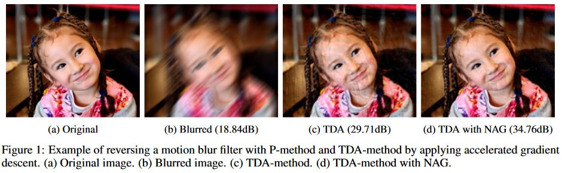

# ReverseFilter TDA

This repository contains the official MATLAB implementation of the TDA method for reverse image filtering proposed in the paper: "Reverse image filtering using total derivative approximation and accelerated gradient descent". 

The paper is under review on IEEE Transactions on Image Processing, a preprint version can be found on Arxiv. 

    

